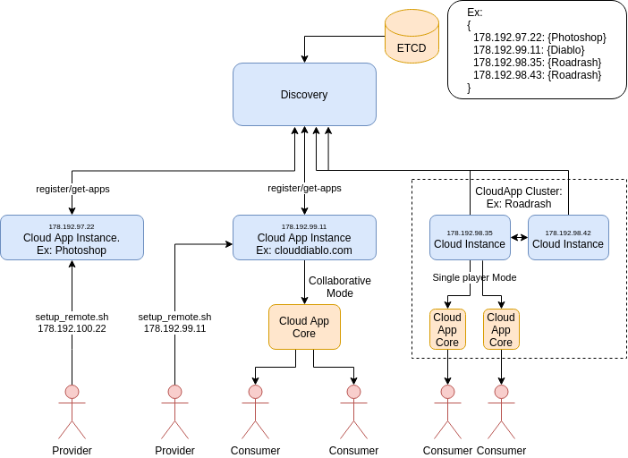

**Decentralized, Self-hosted cloud gaming/cloud application service.**

## Introduction

CloudMorph is a decentralized, self-hosted cloud gaming/cloud application platform. User can host their cloud gaming solution with minimum configuration. By leveraging the ease of deployment, CloudMorph goal is to build a decentralized cloud-gaming network with providers and consumers.  
To bring a scalable, performant and universal cloud gaming solution, CloudMorph has to cope with many technical challenges in Low Latency Streaming, Windows application Virtualization in headless server, OS event simulation, Video/Audio encoding pipeline and optimization, NAT traversal, P2P network structurization, etc.
Unlike [CloudRetro](https://github.com/giongto35/cloud-game), which is a completed Cloud Gaming solution for Retro Game hosted on a dedicated cloud infrastructure, CloudMorph decentralized the hosting to users for any Windows Games/Applications by a generic and modularized solution.

**Discord**: [Join Us](https://discord.gg/ux2rDqwu2W)

## Demo

Video Demo: https://www.youtube.com/watch?v=fkOpOQ-HwFY

|                       Screenshot                       |                        Screenshot                         |
| :----------------------------------------------------: | :-------------------------------------------------------: |
|  [Diablo II-US](http://us.clouddiablo.com/) |  [Starcraft](http://cloudstarcraft.com/) |
|  [RoadRash](https://www.youtube.com/watch?v=A2JcFaVlOO4) |   Browse and Switch games |

#### CloudMorph Demo
- [Cloud Diablo SG](http://clouddiablo.com/) (Demo of Collaborative play Diablo running on Singapore server using CloudMorph).
- [Cloud Diablo US](http://us.clouddiablo.com/) (Demo of Collaborative play Diablo running in US server).
Switch applications using the sidebar on the left.

#### Getting Started
#### Experience deployment on your own:
- Run `setup_remote.sh 111.111.111.111` with ``111.111.111.111`` is your host. What you will get is a Notepad hosted on your remote machine. More details about deployment is at below.

## Design Goal:
1. **Cloud gaming**: Game is run in a remote cloud instance. Video/Audio are streamed to user in the most optimal way using advanced encoding technology.
2. **Cross-platform compatibility**: App is run on web browser, the most universal built-in that can fit in multiple platforms Desktop/Mobile. No console, plugin, external app or devices are needed.
3. **Deployment Simplicity**: No API/ interface integration needed from application. One line script deployment to a server to get work done.
4. **Mesh network**: Providers-Consumers over Peer To Peer communication. After joining the network, Provider's Application is discoverable and launched with one click.
5. **Modularizable**: A concise technical stack to **develop**/**deploy** for cloud gaming/ cloud application service.
6. **Scalable**: Able to provision new machines, and scale on headless machines cluster horizontally.

## Deployment

Foremost, we need an Ubuntu instance with a public network firewall. For example, we can use the given `script/create_do.sh` to create a digital ocean instance.
Then we put below 4 in the same folder:
1. `config.yaml`: app config, the app configuration
3. `wine`: whole wine folder from `.wine`. If there is no wine folder, the deployment will use the default `.wine` from installation.
5. `apps`: a folder contains the app you want to deploy. For example, `DiabloII`. If your application is from other folder ex "Program Files", we can leave it empty. We just need to configure `config.yaml` to point to correct app path
6. `setup_remote.sh`: a script to deploy your application to server

Run:
- `setup_remote.sh $ip`. Ex: `./setup_remote.sh 159.89.146.77`  
- Tutorial Video: https://www.youtube.com/watch?v=w8uCkfZdHVc

**Deployment with Lutris**
- Lutris eases the installation of a game on Linux. **The recommended flow is to install game with Lutris and copy produced wine environment to Cloud Morph**.

**Deployment Example**
- `script/example` contains example applications configuration. Note: `/apps` is left empty due to copyright.

## Development

The service is based on Golang, C++, and Linux X11 utility tools (Xvfb, ffmpeg).
You can set up all dependencies with `setup.sh`. After that, you can run the go server with

- `go run server.go`

Access to your local at

- `localhost:8080`

Note: the wine application is run in Docker. You can run it without docker by changing `run-wine.sh` to `run-wine-nodocker.sh` in `server.go` for easier debugging.

### Design

#### CloudApp Core

1. When a Web Service starts, Application Container, named "CloudApp Core", is spawned. Inside the container there are Application + Virtual Display/Audio + Windows Event Simulation Utility. Multiple Containers can be spawned on demand.
2. A P2P connection will be setup between a client and service. [WebRTC Pion](https://github.com/pion/webrtc) is a great library to handle WebRTC.
3. Input captured from Client is sent to Web Service using WebRTC Data Channel (UDP)
4. Web Service will send received input events to Virtual Machine over a socket.
5. The utility (syncinput.exe) will listen to the input events and simulates equivalent Windows OS event to Wine Application through WinAPI.
6. Application screen/ Audio is captured in a Virtual Display Frame Buffer (XVFB)/ Virtual Audio (PulseAudio), which is later piped to FFMPEG.
7. FFMPEG encode the Video Stream to VPX RTP stream and Audio Stream to Opus stream.

8. Overall, "CloudApp Core" module receives **Input** as WebSocket event and **Output** as RTP stream. It is packaged in container with the interface declared at `core/go/cloudapp`.

#### Decentralize

- If the configuration in `config.yaml` includes `discoveryHost` attribute, application will be discorable by everyone in Discovery list in sidebar.
- In this flow, Client will query discovery host list of joinable host, then the client can pick any application in the discovery list.

### Detailed Technology
[wiki](https://github.com/giongto35/cloud-morph/wiki)

## Real-World Usecase

##### For Developers
- Experience playing/hosting Cloud Gaming on their own.
- Plugable Cloud gaming module: The cloud gaming core is packaged and virtualized to be easily extended to different tech stacks. E.g Python, Java ...

##### For Consumers.
- Multi-platform: be able to run web-browser, mobile web.
- Collaborative Gaming: Multiple people plays the same game. Ex. Twitch play pokemon, or like in http://clouddiablo.com/.

##### For Providers
- Playable Teaser: Application's teaser is playable, so users can experience new game directly on Browser.

## Road Map - Request for Help

- UI improvement
- Full Dockerization. Currently server is not run in Container.
- Port C++ Window API to Rust.
- GPU acceleration. - Integrate with FFMPEG job. 
- Multiplex application sessions. Currently, only collaborative mode is supported, which serves all application's sessions from the same single instance.
- Performance optimization.
- Web Mobile controller supprt. Currently, mouse click is already simulated.
- Packaging frontend as a plugin that can be imported in any Webpage.
